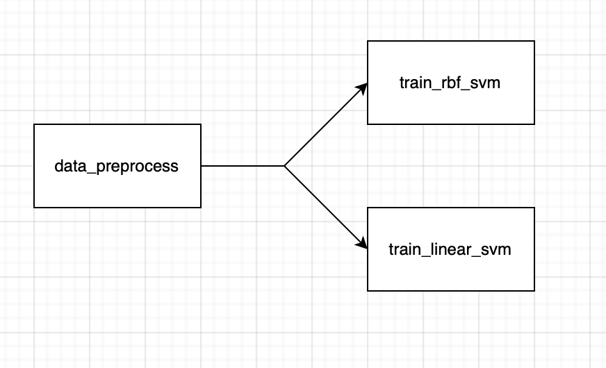

# ml-engineering-practices

Trains different classifiers for voice to male/female classes.

## Formatting and linting

As a formatter I used autopep8 extension for vscode.

Flake8 plugins:
1. flake8-bandit
2. flake8-eradicate
3. flake8-isort
4. flake8-return
5. pep8-naming

## Package

I chose package manager `pip`. Installation guide can be found here https://pip.pypa.io/en/stable/installation/

Tested on OS-X and python 3.9.7

Build the package:
1. activate venv: `python3 -m venv .venv && source .venv/bin/activate`
2. install dev requirements: `pip3 install -r requirements_dev.txt`
3. Run `python3 setup.py sdist`

Publish to test.pypi:
1. Run `twine upload --repository-url https://test.pypi.org/legacy/ dist/*`

Package on pypi: `https://test.pypi.org/project/sound-classifiers/0.0.6/`

Install from pypi:
`pip3 install -i https://test.pypi.org/simple/ sound-classifiers==0.0.6 && pip3 install -r requirements.txt`

Run example:
```
from sound_classifiers.main import main

main()
```

## Working with dvc
I took only small part of the data because the full vesion would have taken too much place at my gdrive.
Also it doesn't work on OS-X and I can't fix it.


## Airflow
1. Put DAG sound_classifiers.py to your airflow directory: `cp sound_classifiers.py ~/airflow/dags`
2. Select directory to run in: `export SC_RUN_DIR='/absolute/path/to/here'` e.g. `export SC_RUN_DIR='/Users/bagryanova/Desktop/hse/ml-engineering-practices'`
3. Run DAG: `python3 main.py airflow`

The DAG runs in this directory for convinience. 

### DAG's description
First of all it runs preprocess_data, then it runs train_rbf_svm and train_linear_svm in parallel. 
CNN training is commented out for speed, but it could also be run with svms in parallel.
